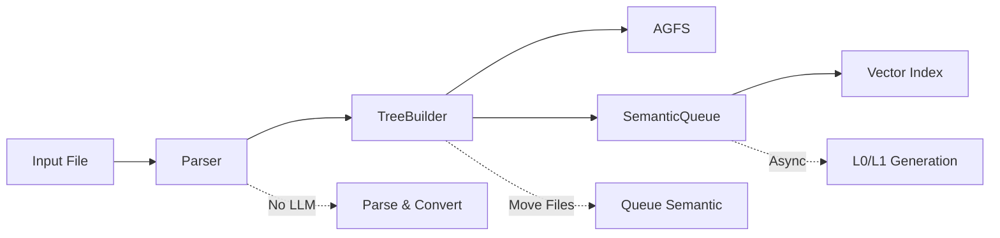
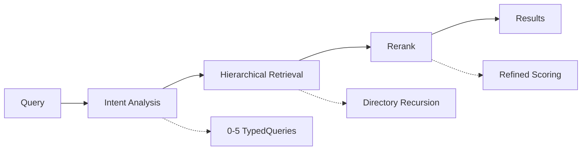
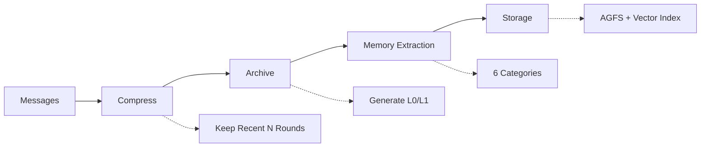

OpenViking is a context database designed for AI Agents, unifying all context types (Memory, Resource, Skill) into a directory structure with semantic retrieval and progressive content loading.

## System Architecture

OpenViking follows a layered architecture pattern separating concerns across Client, Service, Core Modules, and Storage layers:

```
┌────────────────────────────────────────────────────────────────────────────┐
│                        OpenViking System Architecture                       │
├────────────────────────────────────────────────────────────────────────────┤
│                                                                            │
│                              ┌─────────────┐                               │
│                              │   Client    │                               │
│                              │ (OpenViking)│                               │
│                              └──────┬──────┘                               │
│                                     │ delegates                            │
│                              ┌──────▼──────┐                               │
│                              │   Service   │                               │
│                              │    Layer    │                               │
│                              └──────┬──────┘                               │
│                                     │                                      │
│           ┌─────────────────────────┼─────────────────────────┐            │
│           │                         │                         │            │
│           ▼                         ▼                         ▼            │
│    ┌─────────────┐          ┌─────────────┐          ┌─────────────┐      │
│    │  Retrieve   │          │   Session   │          │    Parse    │      │
│    │  (Context   │          │  (Session   │          │  (Context   │      │
│    │  Retrieval) │          │  Management)│          │  Extraction)│      │
│    │ search/find │          │ add/used    │          │ Doc parsing │      │
│    │ Intent      │          │ commit      │          │ L0/L1/L2    │      │
│    │ Rerank      │          │ archive     │          │ Tree build  │      │
│    └──────┬──────┘          └──────┬──────┘          └──────┬──────┘      │
│           │                        │                        │             │
│           │                        │ Memory extraction      │             │
│           │                        ▼                        │             │
│           │                 ┌─────────────┐                 │             │
│           │                 │ Compressor  │                 │             │
│           │                 │ Compress/   │                 │             │
│           │                 │ Deduplicate │                 │             │
│           │                 └──────┬──────┘                 │             │
│           │                        │                        │             │
│           └────────────────────────┼────────────────────────┘             │
│                                    ▼                                      │
│    ┌─────────────────────────────────────────────────────────────────┐    │
│    │                         Storage Layer                            │    │
│    │               AGFS (File Content)  +  Vector Index               │    │
│    └─────────────────────────────────────────────────────────────────┘    │
│                                                                            │
└────────────────────────────────────────────────────────────────────────────┘
```

## Core Modules

<AccordionGroup>
  <Accordion title="Client Layer">
    Provides unified entry point for all operations, delegating to the Service layer.
    
    - Exposes all public APIs (find, search, add_resource, session, etc.)
    - Handles HTTP/SDK client implementations
    - Supports both embedded and remote modes
  </Accordion>

  <Accordion title="Service Layer">
    Implements business logic and decouples from transport layer, enabling reuse across HTTP Server and CLI.
    
    | Service | Responsibility | Key Methods |
    |---------|----------------|-------------|
    | **FSService** | File system operations | ls, mkdir, rm, mv, tree, stat, read, abstract, overview, grep, glob |
    | **SearchService** | Semantic search | search, find |
    | **SessionService** | Session management | session, sessions, commit, delete |
    | **ResourceService** | Resource import | add_resource, add_skill, wait_processed |
    | **RelationService** | Relation management | relations, link, unlink |
    | **PackService** | Import/export | export_ovpack, import_ovpack |
    | **DebugService** | Debug service | observer (ObserverService) |
  </Accordion>

  <Accordion title="Retrieve Module">
    Handles context retrieval with intent analysis and hierarchical search.
    
    - **IntentAnalyzer**: Analyzes query intent, generates 0-5 typed queries
    - **HierarchicalRetriever**: Directory-level recursive search using priority queue
    - **Rerank**: Scalar filtering + model reranking for refined results
  </Accordion>

  <Accordion title="Session Module">
    Manages conversation lifecycle and memory extraction.
    
    - Message recording and usage tracking
    - Session compression and archiving
    - 6-category memory extraction (profile, preferences, entities, events, cases, patterns)
    - LLM-based deduplication decisions
  </Accordion>

  <Accordion title="Parse Module">
    Handles document parsing and context extraction.
    
    - Document parsing (PDF/MD/HTML/Code)
    - Tree building and directory creation
    - Async semantic generation (L0/L1)
    - AST-based code skeleton extraction
  </Accordion>

  <Accordion title="Compressor Module">
    Compresses and extracts memories from sessions.
    
    - 6-category memory extraction
    - LLM deduplication decisions
    - Conflict resolution (merge/delete/skip)
  </Accordion>

  <Accordion title="Storage Layer">
    Dual-layer storage separating content from index.
    
    - **VikingFS**: Virtual filesystem with URI abstraction
    - **AGFS**: Content storage (L0/L1/L2, multimedia files, relations)
    - **Vector Index**: Semantic search (URIs, vectors, metadata)
  </Accordion>
</AccordionGroup>

## Data Flow

### Adding Context



<Steps>
  <Step title="Parser">
    Parse documents, create file and directory structure (no LLM calls)
  </Step>
  <Step title="TreeBuilder">
    Move temp directory to AGFS, enqueue for semantic processing
  </Step>
  <Step title="SemanticQueue">
    Async bottom-up L0/L1 generation using VLM
  </Step>
  <Step title="Vector Index">
    Build index for semantic search
  </Step>
</Steps>

### Retrieving Context



<Steps>
  <Step title="Intent Analysis">
    Analyze query intent, generate 0-5 typed queries by context type
  </Step>
  <Step title="Hierarchical Retrieval">
    Directory-level recursive search using priority queue
  </Step>
  <Step title="Rerank">
    Scalar filtering + model reranking for refined scoring
  </Step>
  <Step title="Results">
    Return contexts sorted by relevance
  </Step>
</Steps>

### Session Commit



<Steps>
  <Step title="Messages">
    Accumulate conversation messages and usage records
  </Step>
  <Step title="Compress">
    Keep recent N rounds, archive older messages
  </Step>
  <Step title="Archive">
    Generate L0/L1 for history segments
  </Step>
  <Step title="Memory Extraction">
    Extract 6-category memories from messages
  </Step>
  <Step title="Storage">
    Write to AGFS + vector index
  </Step>
</Steps>

## Deployment Modes

<CardGroup cols={2}>
  <Card title="Embedded Mode" icon="laptop">
    For local development and single-process applications
    
    ```python
    client = OpenViking(path="./data")
    ```
    
    - Auto-starts AGFS subprocess
    - Uses local vector index
    - Singleton pattern
  </Card>

  <Card title="HTTP Mode" icon="server">
    For team sharing, production deployment, and cross-language integration
    
    ```python
    # Python SDK
    client = SyncHTTPClient(
        url="http://localhost:1933",
        api_key="xxx"
    )
    ```
    
    - Server runs as standalone process
    - Clients connect via HTTP API
    - Supports any language
  </Card>
</CardGroup>

## Design Principles

<Note>
OpenViking follows these core design principles to ensure scalability and maintainability:
</Note>

| Principle | Description |
|-----------|-------------|
| **Pure Storage Layer** | Storage only handles AGFS operations and basic vector search; Rerank is in retrieval layer |
| **Three-Layer Information** | L0/L1/L2 enables progressive detail loading, saving token consumption |
| **Two-Stage Retrieval** | Vector search recalls candidates + Rerank improves accuracy |
| **Single Data Source** | All content read from AGFS; vector index only stores references |

## Code Example: Client Initialization

```python
from openviking import OpenViking
from openviking.http_client import SyncHTTPClient

# Embedded mode (local development)
client = OpenViking(path="./data")

# HTTP mode (production)
client = SyncHTTPClient(
    url="http://localhost:1933",
    api_key="your-api-key"
)

# Add resource
await client.add_resource(
    "https://docs.example.com/api.pdf",
    reason="API documentation"
)

# Search across all contexts
results = await client.find("authentication methods")

for ctx in results.resources:
    print(f"Resource: {ctx.uri}")
    print(f"Abstract: {ctx.abstract}")
```

## Related Concepts

<CardGroup cols={2}>
  <Card title="Context Types" icon="shapes" href="/concepts/context-types">
    Learn about Resource, Memory, and Skill types
  </Card>
  <Card title="Context Layers" icon="layer-group" href="/concepts/context-layers">
    Understand L0/L1/L2 progressive loading
  </Card>
  <Card title="Viking URI" icon="link" href="/concepts/viking-uri">
    Unified resource identifier system
  </Card>
  <Card title="Storage" icon="database" href="/concepts/storage">
    Dual-layer storage architecture
  </Card>
</CardGroup>