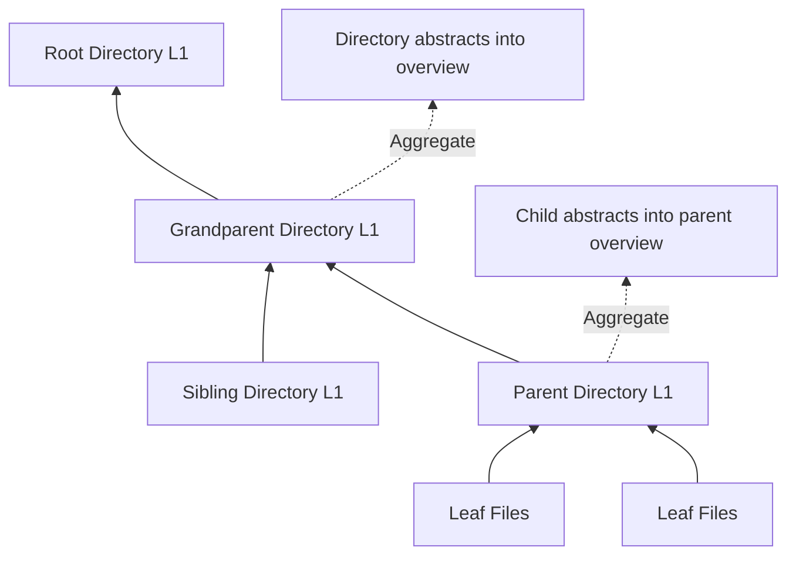

OpenViking uses a **three-layer information model** (L0/L1/L2) to balance retrieval efficiency and content completeness. This design enables progressive detail loading, significantly reducing token consumption while maintaining context quality.

## Overview

<CardGroup cols={3}>
  <Card title="L0: Abstract" icon="file-lines">
    ~100 tokens
    
    Quick filtering and vector search
  </Card>
  <Card title="L1: Overview" icon="file-text">
    ~2k tokens
    
    Content navigation and rerank
  </Card>
  <Card title="L2: Detail" icon="file">
    Unlimited
    
    Full content, on-demand loading
  </Card>
</CardGroup>

| Layer | Name | File | Token Limit | Purpose |
|-------|------|------|-------------|------|
| **L0** | Abstract | `.abstract.md` | ~100 tokens | Vector search, quick filtering |
| **L1** | Overview | `.overview.md` | ~2k tokens | Rerank, content navigation |
| **L2** | Detail | Original files/subdirs | Unlimited | Full content, on-demand loading |

## L0: Abstract

The most concise representation of content, used for vector retrieval and quick filtering.

### Characteristics

- **Ultra-short**: Maximum ~100 tokens
- **Quick perception**: Allows Agent to quickly perceive content relevance
- **Vectorized**: Used for semantic search in vector index
- **Always text**: Even for multimedia content, L0 is text description

### Example: Documentation Abstract

```markdown
API authentication guide covering OAuth 2.0, JWT tokens, and API keys for secure access.
```

### Example: Code File Abstract

```markdown
Python module implementing hierarchical retrieval with directory-based recursive search and rerank scoring.
```

### API Usage

```python
from openviking import OpenViking

client = OpenViking()

# Get L0 abstract
abstract = await client.abstract("viking://resources/docs/auth")
print(abstract)
# Output: "API authentication guide covering OAuth 2.0, JWT tokens..."

# Abstract is also available in search results
results = await client.find("authentication")
for ctx in results.resources:
    print(f"URI: {ctx.uri}")
    print(f"Abstract: {ctx.abstract}")  # L0 content
```

## L1: Overview

Comprehensive summary with navigation guidance, used for rerank and understanding access methods.

### Characteristics

- **Moderate length**: ~1-2k tokens
- **Navigation guide**: Tells Agent how to access detailed content
- **Structural information**: Describes subdirectories and file organization
- **Usage hints**: Provides guidance on when to load L2 details

### Example: Documentation Overview

```markdown
# Authentication Guide Overview

This guide covers three authentication methods for the API:

## Sections
- **OAuth 2.0** (L2: oauth.md): Complete OAuth flow with code examples
  - Authorization code flow
  - Implicit grant flow
  - Token refresh mechanism
  
- **JWT Tokens** (L2: jwt.md): Token generation and validation
  - Token structure and claims
  - Signature verification
  - Expiration handling
  
- **API Keys** (L2: api-keys.md): Simple key-based authentication
  - Key generation and management
  - Header-based authentication
  - Rate limiting considerations

## Key Points
- OAuth 2.0 recommended for user-facing applications
- JWT for service-to-service communication
- API Keys for simple integrations and testing

## Access
Use `read("viking://resources/docs/auth/oauth.md")` for full OAuth documentation.
Use `read("viking://resources/docs/auth/jwt.md")` for JWT details.
```

### Example: Code Module Overview

```markdown
# Hierarchical Retriever Overview

Implements directory-based hierarchical retrieval with recursive search and rerank scoring.

## Key Classes
- **HierarchicalRetriever**: Main retriever class with recursive search algorithm
- **RetrieverMode**: THINKING (with rerank) vs QUICK (vector only)

## Key Methods
- `retrieve()`: Execute hierarchical retrieval with intent-based queries
- `_recursive_search()`: Recursive directory traversal using priority queue
- `_merge_starting_points()`: Combine root directories with global search results

## Algorithm
1. Determine starting directories based on context type
2. Global vector search to supplement starting points
3. Recursive search using priority queue (score propagation)
4. Convergence detection (stop after 3 unchanged rounds)

## Access
Read full implementation at `viking://resources/openviking/retrieve/hierarchical_retriever.py`
```

### API Usage

```python
# Get L1 overview
overview = await client.overview("viking://resources/docs/auth")
print(overview)

# Use overview to decide if L2 is needed
if "OAuth 2.0" in overview and needs_oauth_details:
    # Load full OAuth documentation (L2)
    content = await client.read("viking://resources/docs/auth/oauth.md")
```

## L2: Detail

Complete original content, loaded only when needed.

### Characteristics

- **Full content**: No token limit, preserves all information
- **On-demand loading**: Read only when confirmed necessary through L0/L1
- **Original format**: Preserves source structure and formatting
- **Multimodal**: Can be text, image, video, audio, or binary files

### Example: Full Documentation

```markdown
# OAuth 2.0 Authentication

## Overview
OAuth 2.0 is an authorization framework that enables applications to obtain 
limited access to user accounts on an HTTP service.

## Authorization Code Flow

### Step 1: Authorization Request
Direct the user to the authorization endpoint:

```
GET /oauth/authorize?
  response_type=code&
  client_id=YOUR_CLIENT_ID&
  redirect_uri=YOUR_REDIRECT_URI&
  scope=read write
```

### Step 2: User Authorization
The user authenticates and grants permission...

[... full documentation continues for several thousand tokens ...]
```

### API Usage

```python
# Load full content (L2)
content = await client.read("viking://resources/docs/auth/oauth.md")
print(content)

# For binary files
image_data = await client.read("viking://resources/images/diagram.png")
```

## Generation Mechanism

<Note>
L0 and L1 layers are automatically generated by OpenViking's semantic processing system.
</Note>

### When Generated

<Tabs>
  <Tab title="Resource Addition">
    When adding resources, L0/L1 are generated asynchronously:
    
    1. **Parser** parses document and creates directory structure
    2. **TreeBuilder** moves files to AGFS and enqueues semantic processing
    3. **SemanticQueue** processes bottom-up, generating L0/L1 for each directory
    4. **Vector Index** stores L0/L1 vectors for semantic search
  </Tab>
  
  <Tab title="Session Archiving">
    When committing sessions, L0/L1 are generated for archived history:
    
    1. **Session.commit()** triggers compression
    2. **Compressor** archives older messages to history directory
    3. **Semantic generation** creates L0/L1 for archived segment
    4. **Vector Index** indexes archived conversation for future retrieval
  </Tab>
</Tabs>

### Who Generates

| Component | Responsibility |
|-----------|----------------|
| **SemanticProcessor** | Traverses directories bottom-up, generates L0/L1 for each |
| **SessionCompressor** | Generates L0/L1 for archived session history |
| **VLM Model** | Provides summarization and abstraction via API |

### Generation Order



**Bottom-up aggregation**: Child directory L0s are aggregated into parent L1, forming hierarchical navigation.

<Steps>
  <Step title="Process Leaf Nodes">
    Generate L0/L1 for individual files at the deepest level
  </Step>
  <Step title="Aggregate to Parent">
    Collect child abstracts and generate parent directory L0/L1
  </Step>
  <Step title="Recursive Upward">
    Continue aggregating up the directory tree
  </Step>
  <Step title="Complete at Root">
    Final root directory L0/L1 provides project-level overview
  </Step>
</Steps>

## Directory Structure

Each directory follows a unified file structure:

```
viking://resources/docs/auth/
├── .abstract.md          # L0: ~100 tokens
├── .overview.md          # L1: ~1-2k tokens
├── .relations.json       # Related resources
├── oauth.md              # L2: Full content
├── jwt.md                # L2: Full content
└── api-keys.md           # L2: Full content
```

<Warning>
**Special files starting with `.` are system-managed:**
- `.abstract.md` - Auto-generated L0 summary
- `.overview.md` - Auto-generated L1 overview
- `.relations.json` - System-managed relations
- `.meta.json` - System metadata

Do not manually edit these files.
</Warning>

## Multimodal Support

<Info>
OpenViking supports multimodal content with text-based L0/L1 descriptions.
</Info>

### Text Content

- **L0/L1**: Generated from text content
- **L2**: Original text file

### Multimedia Content

For binary content (images, videos, audio), L0/L1 describe in text:

<Tabs>
  <Tab title="Image">
    ```markdown
    # L0: .abstract.md
    Product screenshot showing login page with OAuth buttons.
    
    # L1: .overview.md
    ## Image: Login Page Screenshot
    
    This screenshot shows the application's login page with:
    - Google OAuth button (top)
    - GitHub OAuth button (middle)
    - Email/password form (bottom)
    
    Dimensions: 1920x1080, Format: PNG
    
    ## Access
    Use `read("viking://resources/images/login.png")` to load the full image.
    ```
  </Tab>
  
  <Tab title="Video">
    ```
    viking://resources/training/
    ├── Developer Notes/
    │   ├── .abstract.md              # L0: Video description
    │   ├── .overview.md              # L1: Detailed summary with timestamps
    │   ├── audio_and_subtitles.md    # Transcription
    │   ├── developer_training.mp4    # L2: Full video
    │   └── video_segments/           # Segmented clips
    │       ├── training_0s-30s.mp4
    │       └── training_30s-60s.mp4
    ```
  </Tab>
</Tabs>

## Best Practices

<AccordionGroup>
  <Accordion title="Quick relevance check - Use L0">
    When you need to quickly filter relevant contexts from search results:
    
    ```python
    results = await client.find("authentication")
    
    # L0 abstracts are already in results
    for ctx in results.resources:
        if "OAuth" in ctx.abstract:  # Quick check using L0
            print(f"Relevant: {ctx.uri}")
    ```
  </Accordion>
  
  <Accordion title="Understand content scope - Use L1">
    When you need to understand what a resource contains before loading:
    
    ```python
    # Get L1 overview first
    overview = await client.overview("viking://resources/docs/auth")
    
    # Understand structure and decide which L2 to load
    if "OAuth 2.0" in overview:
        print("This contains OAuth documentation")
    ```
  </Accordion>
  
  <Accordion title="Detailed information extraction - Use L2">
    Only load L2 when you need the complete content:
    
    ```python
    # Load L2 only after confirming relevance via L0/L1
    content = await client.read("viking://resources/docs/auth/oauth.md")
    
    # Now you have the full content
    print(content)
    ```
  </Accordion>
  
  <Accordion title="Building context for LLM - Use L1">
    L1 is usually sufficient for building context:
    
    ```python
    # Get L1 overviews for multiple resources
    context_parts = []
    for uri in relevant_uris:
        overview = await client.overview(uri)
        context_parts.append(f"## {uri}\n{overview}")
    
    # Build prompt with L1 content (saves tokens)
    prompt = "\n\n".join(context_parts)
    ```
  </Accordion>
</AccordionGroup>

### Token Budget Management

```python
# Progressive loading pattern
async def get_context_with_budget(uri: str, max_tokens: int):
    """Load context progressively based on token budget."""
    
    # Always start with L0 (~100 tokens)
    abstract = await client.abstract(uri)
    
    if max_tokens < 500:
        return abstract  # Return L0 only
    
    # Load L1 if budget allows (~2k tokens)
    overview = await client.overview(uri)
    
    if max_tokens < 5000:
        return overview  # Return L1 only
    
    # Load L2 only if budget is sufficient
    content = await client.read(uri)
    return content
```

## Implementation Details

<CodeGroup>
```python openviking/core/context.py
class ContextLevel(int, Enum):
    """Context level (L0/L1/L2) for vector indexing"""
    
    ABSTRACT = 0  # L0: abstract
    OVERVIEW = 1  # L1: overview  
    DETAIL = 2    # L2: detail/content

class Context:
    def __init__(self, uri: str, level: int = None, ...):
        self.uri = uri
        self.level = int(level) if level is not None else None
        self.abstract = abstract  # L0 content
        # L1/L2 content read from AGFS as needed
```

```python openviking/storage/viking_fs.py
class VikingFS:
    async def abstract(self, uri: str) -> str:
        """Read L0 abstract."""
        content = await self.agfs.read_file(
            f"{uri}/.abstract.md"
        )
        return content
    
    async def overview(self, uri: str) -> str:
        """Read L1 overview."""
        content = await self.agfs.read_file(
            f"{uri}/.overview.md"
        )
        return content
    
    async def read(self, uri: str) -> str:
        """Read L2 full content."""
        content = await self.agfs.read_file(uri)
        return content
```
</CodeGroup>

## Related Concepts

<CardGroup cols={2}>
  <Card title="Architecture" icon="diagram-project" href="/concepts/architecture">
    System architecture and data flow
  </Card>
  <Card title="Context Types" icon="shapes" href="/concepts/context-types">
    Resource, Memory, and Skill types
  </Card>
  <Card title="Viking URI" icon="link" href="/concepts/viking-uri">
    URI specification and structure
  </Card>
  <Card title="Extraction" icon="file-import" href="/concepts/extraction">
    L0/L1 generation details
  </Card>
</CardGroup>