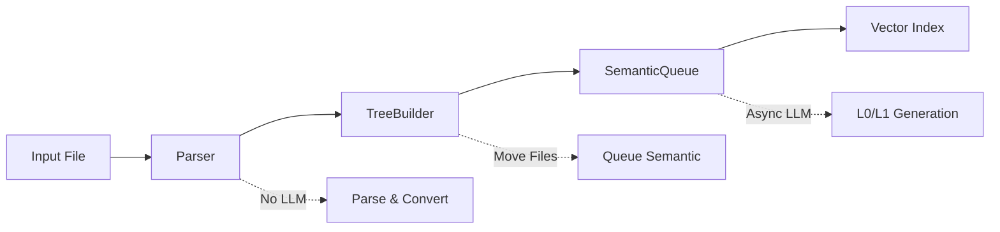
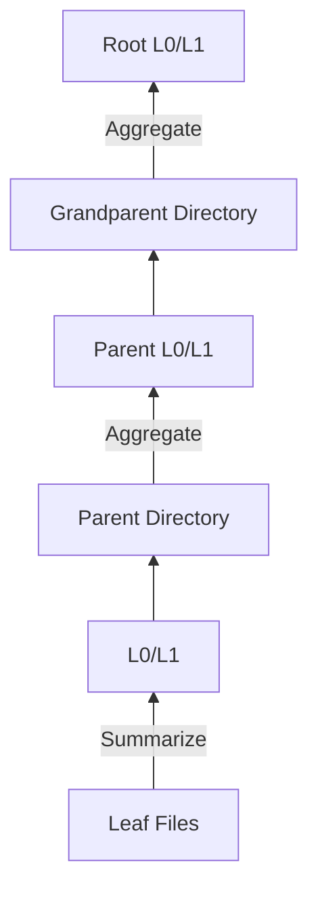

OpenViking uses a **three-stage async architecture** for document parsing and context extraction, separating fast parsing from slow semantic generation for optimal performance.

## Overview



<Info>
**Design Principle**: Parsing and semantics are separated. Parser doesn't call LLM; semantic generation is async.
</Info>

<Steps>
  <Step title="Parser">
    Parse documents, create file and directory structure **(no LLM calls)**
  </Step>
  <Step title="TreeBuilder">
    Move temp directory to AGFS, queue for semantic processing
  </Step>
  <Step title="SemanticQueue">
    Async bottom-up L0/L1 generation **(uses VLM)**
  </Step>
  <Step title="Vector Index">
    Index generated L0/L1 for semantic search
  </Step>
</Steps>

## Stage 1: Parser

Parser handles document format conversion and structuring, creating file structure in temp directory.

### Supported Formats

<Tabs>
  <Tab title="Documents">
    | Format | Parser | Extensions | Features |
    |--------|--------|------------|----------|
    | **Markdown** | MarkdownParser | `.md`, `.markdown` | Header-based splitting |
    | **Plain text** | TextParser | `.txt` | Simple text parsing |
    | **PDF** | PDFParser | `.pdf` | Text + image extraction |
    | **HTML** | HTMLParser | `.html`, `.htm` | DOM-based parsing |
  </Tab>
  
  <Tab title="Code">
    | Language | Extensions | AST Support |
    |----------|-----------|-------------|
    | **Python** | `.py` | ✅ tree-sitter |
    | **JavaScript** | `.js`, `.jsx` | ✅ tree-sitter |
    | **TypeScript** | `.ts`, `.tsx` | ✅ tree-sitter |
    | **Rust** | `.rs` | ✅ tree-sitter |
    | **Go** | `.go` | ✅ tree-sitter |
    | **Java** | `.java` | ✅ tree-sitter |
    | **C/C++** | `.c`, `.cpp`, `.h`, `.hpp` | ✅ tree-sitter |
    
    For code files, see [Code Skeleton Extraction](#code-skeleton-extraction-ast-mode) below.
  </Tab>
  
  <Tab title="Multimedia">
    | Format | Parser | Extensions | Features |
    |--------|--------|------------|----------|
    | **Image** | ImageParser | `.png`, `.jpg`, `.jpeg`, `.gif` | VLM description |
    | **Video** | VideoParser | `.mp4`, `.avi`, `.mov` | Segmentation + transcription |
    | **Audio** | AudioParser | `.mp3`, `.wav`, `.m4a` | Transcription |
  </Tab>
</Tabs>

### Core Flow

```python
from openviking.parse import ParserRegistry

registry = ParserRegistry()

# 1. Parse file
parse_result = await registry.parse("/path/to/doc.pdf")

# 2. Returns temp directory URI
print(parse_result.temp_dir_path)  # viking://temp/abc123
print(parse_result.source_format)  # "pdf"
print(parse_result.parser_name)    # "PDFParser"
```

### Smart Splitting

Parser automatically splits documents based on size:

```python
if document_tokens <= 1024:
    # Save as single file
    save_as_single_file(content)
else:
    # Split by headers
    sections = split_by_headers(content)
    
    for section in sections:
        if section.tokens < 512:
            # Merge small sections
            merge_with_next(section)
        elif section.tokens > 1024:
            # Create subdirectory for large sections
            create_subdirectory(section)
        else:
            # Save as individual file
            save_section(section)
```

<Note>
This ensures each file is appropriately sized for LLM processing while maintaining document structure.
</Note>

### Example: Markdown Parsing

**Input:**
```markdown
# API Documentation

## Authentication
### OAuth 2.0
[... 800 tokens ...]

### JWT Tokens  
[... 600 tokens ...]

## Endpoints
### User Management
[... 1500 tokens ...]
```

**Output structure:**
```
viking://temp/abc123/
├── API Documentation/
    ├── Authentication/
    │   ├── oauth.md           # 800 tokens
    │   └── jwt.md             # 600 tokens
    └── Endpoints/
        └── User Management/   # Subdirectory (>1024 tokens)
            └── content.md
```

### ParseResult

```python
from dataclasses import dataclass
from typing import Dict

@dataclass
class ParseResult:
    temp_dir_path: str    # Temp directory URI (viking://temp/xxx)
    source_format: str    # Source format (pdf/markdown/html)
    parser_name: str      # Parser class name
    parse_time: float     # Duration in seconds
    meta: Dict            # Additional metadata
```

## Stage 2: TreeBuilder

TreeBuilder moves temp directory to AGFS and queues semantic processing.

### 5-Phase Processing

<Steps>
  <Step title="Find document root">
    Ensure exactly 1 subdirectory in temp (the parsed document)
    
    ```python
    temp_contents = await agfs.list_directory(temp_dir_path)
    assert len(temp_contents) == 1, "Must have exactly one root directory"
    doc_root = temp_contents[0]
    ```
  </Step>
  
  <Step title="Determine target URI">
    Map base URI by scope
    
    | Scope | Base URI |
    |-------|----------|
    | `resources` | `viking://resources/` |
    | `user` | `viking://user/{user_id}/` |
    | `agent` | `viking://agent/{agent_id}/` |
  </Step>
  
  <Step title="Recursively move directory tree">
    Copy all files from temp to AGFS
    
    ```python
    await agfs.move_recursive(
        source=f"{temp_dir_path}/{doc_root}",
        target=target_uri
    )
    ```
  </Step>
  
  <Step title="Clean up temp directory">
    Delete temp files
    
    ```python
    await agfs.rm(temp_dir_path, recursive=True)
    ```
  </Step>
  
  <Step title="Queue semantic generation">
    Submit SemanticMsg to queue
    
    ```python
    semantic_msg = SemanticMsg(
        id=str(uuid4()),
        uri=target_uri,
        context_type="resource",
        status="pending"
    )
    await semantic_queue.enqueue(semantic_msg)
    ```
  </Step>
</Steps>

### Usage Example

```python
from openviking.parse.tree_builder import TreeBuilder

tree_builder = TreeBuilder(agfs, semantic_queue)

# Finalize parsed document
building_tree = await tree_builder.finalize_from_temp(
    temp_dir_path="viking://temp/abc123",
    scope="resources",  # or "user", "agent"
    target_name="my-api-docs"  # Optional custom name
)

print(f"Moved to: {building_tree.target_uri}")
# Output: viking://resources/my-api-docs/
```

## Stage 3: SemanticQueue

SemanticQueue handles async L0/L1 generation and vectorization using VLM.

### Processing Flow (Bottom-up)



<Info>
Processing starts from leaf files and moves upward, aggregating child abstracts into parent overviews.
</Info>

### Single Directory Processing Steps

<Steps>
  <Step title="Concurrent file summary generation">
    Generate summaries for all files in directory (max 10 concurrent)
    
    ```python
    # Limit concurrent LLM calls to avoid rate limits
    semaphore = asyncio.Semaphore(max_concurrent_llm)  # 10
    
    async with semaphore:
        summary = await vlm.summarize(file_content)
    ```
  </Step>
  
  <Step title="Collect child directory abstracts">
    Read generated `.abstract.md` from subdirectories
    
    ```python
    child_abstracts = []
    for subdir in subdirectories:
        abstract = await agfs.read_file(
            f"{subdir}/.abstract.md"
        )
        child_abstracts.append(abstract)
    ```
  </Step>
  
  <Step title="Generate .overview.md">
    LLM generates L1 overview from file summaries + child abstracts
    
    ```python
    overview = await vlm.generate_overview(
        file_summaries=file_summaries,
        child_abstracts=child_abstracts,
        max_tokens=2000
    )
    ```
  </Step>
  
  <Step title="Extract .abstract.md">
    Extract L0 from overview (first 1-2 sentences)
    
    ```python
    abstract = await vlm.extract_abstract(
        overview=overview,
        max_tokens=100
    )
    ```
  </Step>
  
  <Step title="Write files and vectorize">
    Save to AGFS and create vector index entries
    
    ```python
    # Write L0/L1 to AGFS
    await agfs.write_file(
        f"{uri}/.abstract.md", abstract
    )
    await agfs.write_file(
        f"{uri}/.overview.md", overview
    )
    
    # Enqueue for vectorization
    for level, text in [(0, abstract), (1, overview)]:
        context = Context(
            uri=uri,
            level=level,
            abstract=abstract,
            ...
        )
        context.set_vectorize(Vectorize(text=text))
        await embedding_queue.enqueue(context)
    ```
  </Step>
</Steps>

### Configuration Parameters

```json
{
  "vlm": {
    "max_concurrent": 100  // Max concurrent LLM calls
  },
  "semantic": {
    "max_concurrent_llm": 10,       // Per-directory concurrent calls
    "max_images_per_call": 10,      // Max images per VLM call
    "max_sections_per_call": 20     // Max sections per VLM call
  }
}
```

### SemanticMsg Structure

```python
from dataclasses import dataclass

@dataclass
class SemanticMsg:
    id: str                # UUID
    uri: str              # Directory URI
    context_type: str     # resource/memory/skill
    status: str           # pending/processing/completed/failed
    created_at: datetime
    updated_at: datetime
```

## Code Skeleton Extraction (AST Mode)

For code files, OpenViking supports AST-based skeleton extraction via **tree-sitter** as a lightweight alternative to LLM summarization.

<Note>
AST mode significantly reduces processing cost by extracting structural information without LLM calls.
</Note>

### Modes

Controlled by `code_summary_mode` in `ov.conf`:

| Mode | Description | LLM Usage |
|------|-------------|----------|
| **`ast`** | Extract structural skeleton for files ≥100 lines | None (default) |
| **`llm`** | Always use LLM for summarization | High |
| **`ast_llm`** | Extract AST skeleton first, then pass to LLM | Reduced |

```json
{
  "code": {
    "summary_mode": "ast"  // or "llm", "ast_llm"
  }
}
```

### What AST Extracts

<Tabs>
  <Tab title="Python">
    ```python
    # Input: hierarchical_retriever.py
    """Hierarchical retriever for OpenViking."""
    
    import heapq
    from typing import List
    
    class HierarchicalRetriever:
        """Hierarchical retriever with dense and sparse vector support."""
        
        def __init__(self, storage, embedder):
            """Initialize hierarchical retriever."""
            self.storage = storage
        
        async def retrieve(self, query, limit=5):
            """Execute hierarchical retrieval."""
            # ... implementation ...
    ```
    
    **Extracted skeleton:**
    ```python
    # Hierarchical retriever for OpenViking.
    
    import heapq
    from typing import List
    
    class HierarchicalRetriever:
        """Hierarchical retriever with dense and sparse vector support."""
        
        def __init__(self, storage, embedder):
            """Initialize hierarchical retriever."""
        
        async def retrieve(self, query, limit=5):
            """Execute hierarchical retrieval."""
    ```
  </Tab>
  
  <Tab title="TypeScript">
    ```typescript
    // Input: client.ts
    /**
     * OpenViking HTTP client
     */
    
    export class HTTPClient {
      /** Initialize client with URL */
      constructor(url: string, apiKey?: string) {
        this.url = url;
      }
      
      /** Search for contexts */
      async find(query: string): Promise<FindResult> {
        // ... implementation ...
      }
    }
    ```
    
    **Extracted skeleton:**
    ```typescript
    // OpenViking HTTP client
    
    export class HTTPClient {
      /** Initialize client with URL */
      constructor(url: string, apiKey?: string)
      
      /** Search for contexts */
      async find(query: string): Promise<FindResult>
    }
    ```
  </Tab>
</Tabs>

### Fallback Behavior

AST extraction automatically falls back to LLM when:

- Language not in supported list
- File has fewer than 100 lines
- AST parse error occurs
- Extraction produces empty skeleton

<Warning>
Fallback is automatic and logged. The overall pipeline continues without interruption.
</Warning>

## Three Context Types Extraction

Different context types follow the same pipeline with different target URIs:

<Tabs>
  <Tab title="Resource">
    ```python
    # Add resource
    await client.add_resource(
        "/path/to/doc.pdf",
        reason="API documentation"
    )
    
    # Flow:
    # 1. Parser -> viking://temp/abc123/
    # 2. TreeBuilder(scope=resources) -> viking://resources/doc/
    # 3. SemanticQueue -> Generate L0/L1
    # 4. Vector Index -> Index for search
    ```
  </Tab>
  
  <Tab title="Skill">
    ```python
    # Add skill
    await client.add_skill({
        "name": "search-web",
        "content": "# search-web\n..."
    })
    
    # Flow:
    # 1. Direct write to viking://agent/skills/search-web/
    # 2. SemanticQueue -> Generate L0/L1
    # 3. Vector Index -> Index for search
    ```
  </Tab>
  
  <Tab title="Memory">
    ```python
    # Memory auto-extracted from session
    await session.commit()
    
    # Flow:
    # 1. MemoryExtractor -> Extract 6-category memories
    # 2. TreeBuilder(scope=user/agent) -> viking://user/memories/
    # 3. SemanticQueue -> Generate L0/L1
    # 4. Vector Index -> Index for search
    ```
  </Tab>
</Tabs>

## Complete Example

```python
from openviking import OpenViking

client = OpenViking()

# Add resource (triggers full extraction pipeline)
await client.add_resource(
    "https://example.com/api-docs.pdf",
    reason="API documentation"
)

# Wait for semantic processing to complete (optional)
await client.wait_processed()

# Now L0/L1 are generated and indexed
results = await client.find("authentication")

for ctx in results.resources:
    # L0 abstract available immediately
    print(f"Abstract: {ctx.abstract}")
    
    # L1 overview loaded on demand
    overview = await client.overview(ctx.uri)
    print(f"Overview: {overview}")
    
    # L2 full content loaded on demand  
    if need_details:
        content = await client.read(ctx.uri)
        print(f"Content: {content}")
```

## Related Concepts

<CardGroup cols={2}>
  <Card title="Architecture" icon="diagram-project" href="/concepts/architecture">
    System architecture and data flow
  </Card>
  <Card title="Context Layers" icon="layer-group" href="/concepts/context-layers">
    L0/L1/L2 model details
  </Card>
  <Card title="Storage" icon="database" href="/concepts/storage">
    AGFS and vector index
  </Card>
  <Card title="Session" icon="comments" href="/concepts/session">
    Memory extraction details
  </Card>
</CardGroup>