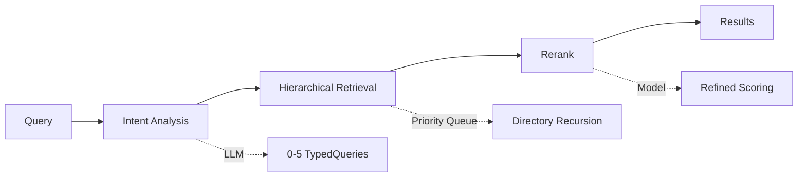

OpenViking uses a **two-stage retrieval mechanism**: intent analysis + hierarchical retrieval + rerank, enabling accurate context discovery across complex directory structures.

## Overview



<Steps>
  <Step title="Intent Analysis">
    Analyze query intent, generate 0-5 typed queries
  </Step>
  <Step title="Hierarchical Retrieval">
    Directory-level recursive search using priority queue
  </Step>
  <Step title="Rerank">
    Scalar filtering + model reranking
  </Step>
  <Step title="Results">
    Return contexts sorted by relevance
  </Step>
</Steps>

## find() vs search()

OpenViking provides two retrieval APIs with different trade-offs:

<Tabs>
  <Tab title="find()">
    **Simple, fast retrieval without session context**
    
    ```python
    results = await client.find(
        "OAuth authentication",
        target_uri="viking://resources/"
    )
    ```
    
    | Feature | Value |
    |---------|-------|
    | Session context | Not needed |
    | Intent analysis | Not used |
    | Query count | Single query |
    | Latency | Low |
    | Use case | Simple queries, known context type |
  </Tab>
  
  <Tab title="search()">
    **Complex, context-aware retrieval**
    
    ```python
    results = await client.search(
        "Help me create an RFC document",
        session_info=session
    )
    ```
    
    | Feature | Value |
    |---------|-------|
    | Session context | Required |
    | Intent analysis | LLM analysis |
    | Query count | 0-5 TypedQueries |
    | Latency | Higher |
    | Use case | Complex tasks, multi-context needs |
  </Tab>
</Tabs>

<Note>
Use `find()` for simple lookups, `search()` for complex tasks requiring multiple context types.
</Note>

## Stage 1: Intent Analysis

**IntentAnalyzer** uses LLM to analyze query intent and generate 0-5 typed queries.

### Input

<Tabs>
  <Tab title="Session Context">
    ```python
    # Recent conversation context
    session_context = {
        "compression_summary": "User is building an API with OAuth...",
        "recent_messages": [
            {"role": "user", "content": "How do I implement OAuth?"},
            {"role": "assistant", "content": "Here's the OAuth flow..."},
            {"role": "user", "content": "Show me code examples"}
        ]
    }
    ```
  </Tab>
  
  <Tab title="Current Query">
    ```python
    query = "Create an RFC document for this feature"
    ```
  </Tab>
</Tabs>

### Output: TypedQuery

```python
from dataclasses import dataclass
from enum import Enum

class ContextType(str, Enum):
    MEMORY = "memory"
    RESOURCE = "resource" 
    SKILL = "skill"

@dataclass
class TypedQuery:
    query: str              # Rewritten query
    context_type: ContextType  # MEMORY/RESOURCE/SKILL
    intent: str             # Query purpose
    priority: int           # 1-5 priority
    target_directories: List[str]  # Optional target URIs
```

### Query Styles by Type

<Tabs>
  <Tab title="Skill (Verb-first)">
    Skills are action-oriented, so queries use verbs:
    
    ```python
    TypedQuery(
        query="Create RFC document",
        context_type=ContextType.SKILL,
        intent="Find skill to create RFC documents",
        priority=5
    )
    
    TypedQuery(
        query="Extract PDF tables",
        context_type=ContextType.SKILL,
        intent="Find skill to extract data from PDFs",
        priority=4
    )
    ```
  </Tab>
  
  <Tab title="Resource (Noun phrase)">
    Resources are knowledge-oriented, so queries use nouns:
    
    ```python
    TypedQuery(
        query="RFC document template",
        context_type=ContextType.RESOURCE,
        intent="Find RFC document templates and examples",
        priority=4
    )
    
    TypedQuery(
        query="API usage guide",
        context_type=ContextType.RESOURCE,
        intent="Find API documentation",
        priority=3
    )
    ```
  </Tab>
  
  <Tab title="Memory (User's XX)">
    Memories are personal, so queries reference "user's" context:
    
    ```python
    TypedQuery(
        query="User's code style preferences",
        context_type=ContextType.MEMORY,
        intent="Find user's coding style preferences",
        priority=3,
        target_directories=["viking://user/memories/preferences/"]
    )
    
    TypedQuery(
        query="User's previous RFC documents",
        context_type=ContextType.MEMORY,
        intent="Find user's RFC writing experience",
        priority=2,
        target_directories=["viking://user/memories/entities/"]
    )
    ```
  </Tab>
</Tabs>

### Special Cases

<AccordionGroup>
  <Accordion title="0 queries - Chitchat">
    Greetings and chitchat that don't need retrieval:
    
    ```python
    # User: "Hello, how are you?"
    # Intent analysis returns: []
    # No retrieval needed
    ```
  </Accordion>
  
  <Accordion title="Multiple queries - Complex tasks">
    Complex tasks may need skill + resource + memory:
    
    ```python
    # User: "Help me implement OAuth in my API"
    # Intent analysis returns:
    [
        TypedQuery(
            query="Implement OAuth authentication",
            context_type=ContextType.SKILL,
            priority=5
        ),
        TypedQuery(
            query="OAuth 2.0 implementation guide",
            context_type=ContextType.RESOURCE,
            priority=4
        ),
        TypedQuery(
            query="User's API project details",
            context_type=ContextType.MEMORY,
            priority=3
        )
    ]
    ```
  </Accordion>
</AccordionGroup>

## Stage 2: Hierarchical Retrieval

**HierarchicalRetriever** uses priority queue to recursively search directory structure.

### Algorithm Overview

<Steps>
  <Step title="Determine root directories">
    Based on context_type, get starting directories:
    
    | context_type | Root Directories |
    |--------------|------------------|
    | MEMORY | `viking://user/memories`, `viking://agent/memories` |
    | RESOURCE | `viking://resources` |
    | SKILL | `viking://agent/skills` |
  </Step>
  
  <Step title="Global vector search">
    Search entire vector index to locate high-score starting directories
    
    ```python
    global_results = await vector_index.search(
        query=query,
        context_type=context_type,
        limit=3  # GLOBAL_SEARCH_TOPK
    )
    ```
  </Step>
  
  <Step title="Merge starting points">
    Combine root directories with global search results, remove duplicates
  </Step>
  
  <Step title="Recursive search">
    Use priority queue to explore directories recursively (see algorithm below)
  </Step>
  
  <Step title="Convert to MatchedContext">
    Return sorted results with URIs, abstracts, and scores
  </Step>
</Steps>

### Recursive Search Algorithm

```python
# Simplified implementation from hierarchical_retriever.py

SCORE_PROPAGATION_ALPHA = 0.5  # 50% embedding + 50% parent
MAX_CONVERGENCE_ROUNDS = 3     # Stop after 3 unchanged rounds

async def recursive_search(starting_points, query, limit):
    # Priority queue: (negative_score, uri)
    dir_queue = []
    for uri, score in starting_points:
        heapq.heappush(dir_queue, (-score, uri))
    
    collected = []  # All candidates
    convergence_count = 0
    prev_topk = None
    
    while dir_queue and convergence_count < MAX_CONVERGENCE_ROUNDS:
        # Pop highest-score directory
        neg_score, current_uri = heapq.heappop(dir_queue)
        parent_score = -neg_score
        
        # Search children in this directory
        results = await vector_index.search(
            query=query,
            parent_uri=current_uri,
            limit=20
        )
        
        for r in results:
            # Score propagation: combine embedding score with parent score
            final_score = (
                SCORE_PROPAGATION_ALPHA * r.embedding_score +
                (1 - SCORE_PROPAGATION_ALPHA) * parent_score
            )
            
            if final_score > threshold:
                collected.append({
                    "uri": r.uri,
                    "score": final_score,
                    "is_leaf": r.is_leaf
                })
                
                # If directory (not leaf), add to queue for exploration
                if not r.is_leaf:
                    heapq.heappush(dir_queue, (-final_score, r.uri))
        
        # Convergence detection
        current_topk = get_top_k(collected, limit)
        if current_topk == prev_topk:
            convergence_count += 1
        else:
            convergence_count = 0
            prev_topk = current_topk
    
    return sorted(collected, key=lambda x: x["score"], reverse=True)[:limit]
```

<Info>
**Key insight**: Score propagation ensures that contexts in high-score directories are prioritized, even if their individual embedding scores are lower.
</Info>

### Visualization

```
Initial queue: [(0.9, viking://resources/), (0.85, viking://user/memories/)]

Round 1:
  Pop: viking://resources/ (score=0.9)
  Search children:
    - docs/ (embedding=0.8) -> final_score = 0.5*0.8 + 0.5*0.9 = 0.85 ✅
    - examples/ (embedding=0.7) -> final_score = 0.5*0.7 + 0.5*0.9 = 0.8 ✅
  Queue: [(0.85, viking://user/memories/), (0.85, docs/), (0.8, examples/)]

Round 2:
  Pop: viking://user/memories/ (score=0.85)
  Search children:
    - preferences/ (embedding=0.75) -> final_score = 0.5*0.75 + 0.5*0.85 = 0.8 ✅
  Queue: [(0.85, docs/), (0.8, examples/), (0.8, preferences/)]

Round 3:
  Pop: docs/ (score=0.85)
  Search children:
    - api/auth.md (embedding=0.9, is_leaf=true) -> final_score = 0.85 ✅
    - api/endpoints.md (embedding=0.65, is_leaf=true) -> final_score = 0.7 ✅
  Queue: [(0.8, examples/), (0.8, preferences/)]
  
[... continues until convergence or queue empty ...]
```

### Key Parameters

```python
class HierarchicalRetriever:
    MAX_CONVERGENCE_ROUNDS = 3      # Stop after N unchanged rounds
    MAX_RELATIONS = 5               # Max relations per resource
    SCORE_PROPAGATION_ALPHA = 0.5   # Score propagation coefficient
    DIRECTORY_DOMINANCE_RATIO = 1.2 # Directory score threshold
    GLOBAL_SEARCH_TOPK = 3          # Global search candidates
    HOTNESS_ALPHA = 0.2             # Weight for usage frequency
```

## Stage 3: Rerank

Rerank refines candidate results in THINKING mode using specialized reranking models.

### Trigger Conditions

<Tabs>
  <Tab title="THINKING Mode">
    ```python
    # search() uses THINKING mode by default
    results = await client.search(
        "complex query",
        session_info=session
    )
    # Automatically uses rerank if configured
    ```
  </Tab>
  
  <Tab title="QUICK Mode">
    ```python
    # find() uses QUICK mode (no rerank)
    results = await client.find(
        "simple query"
    )
    # Uses vector scores only
    ```
  </Tab>
</Tabs>

### Scoring Method

```python
if rerank_client and mode == RetrieverMode.THINKING:
    # Use rerank model
    scores = await rerank_client.rerank_batch(
        query=query,
        documents=[r.abstract for r in results]
    )
else:
    # Use vector scores
    scores = [r.embedding_score for r in results]

# Sort by final scores
results = sorted(
    zip(results, scores),
    key=lambda x: x[1],
    reverse=True
)
```

### Usage Points

1. **Starting point evaluation**: Evaluate global search candidate directories
2. **Recursive search**: Evaluate children at each level during recursion

### Backend Support

| Backend | Model | Configuration |
|---------|-------|---------------|
| **Volcengine** | doubao-seed-rerank | Requires AK/SK in config |

```json
{
  "rerank": {
    "provider": "volcengine",
    "api_key": "your-ak",
    "api_secret": "your-sk",
    "model": "doubao-seed-rerank",
    "threshold": 0.5
  }
}
```

## Retrieval Results

### MatchedContext

```python
from dataclasses import dataclass
from typing import List

@dataclass
class MatchedContext:
    uri: str                      # Resource URI
    context_type: ContextType     # MEMORY/RESOURCE/SKILL
    is_leaf: bool                 # Whether file (vs directory)
    abstract: str                 # L0 abstract
    score: float                  # Final relevance score
    relations: List[RelatedContext]  # Related contexts

@dataclass
class RelatedContext:
    uri: str                      # Related resource URI
    reason: str                   # Relation reason
```

### FindResult

```python
@dataclass
class FindResult:
    memories: List[MatchedContext]      # User/agent memories
    resources: List[MatchedContext]     # Resources
    skills: List[MatchedContext]        # Skills
    query_plan: Optional[QueryPlan]     # Present for search()
    query_results: Optional[List[QueryResult]]  # Per-query results
    total: int                          # Total matches
```

### Usage Example

```python
results = await client.search(
    "Help me implement OAuth",
    session_info=session
)

# Check query plan (from intent analysis)
if results.query_plan:
    for typed_query in results.query_plan.queries:
        print(f"Query: {typed_query.query}")
        print(f"Type: {typed_query.context_type}")
        print(f"Priority: {typed_query.priority}")

# Process results by type
for skill in results.skills:
    print(f"\nSkill: {skill.uri}")
    print(f"Abstract: {skill.abstract}")
    print(f"Score: {skill.score}")
    
    # Get full skill definition
    overview = await client.overview(skill.uri)
    print(f"Overview: {overview}")

for resource in results.resources:
    print(f"\nResource: {resource.uri}")
    print(f"Abstract: {resource.abstract}")
    
    # Check related resources
    for rel in resource.relations:
        print(f"  Related: {rel.uri} - {rel.reason}")

for memory in results.memories:
    print(f"\nMemory: {memory.uri}")
    print(f"Abstract: {memory.abstract}")
```

## Complete Example

```python
from openviking import OpenViking

client = OpenViking()

# Add some resources
await client.add_resource(
    "https://oauth.net/2/",
    reason="OAuth 2.0 specification"
)

await client.add_skill({
    "name": "implement-oauth",
    "description": "Generate OAuth 2.0 implementation code",
    "content": "..."
})

# Wait for semantic processing
await client.wait_processed()

# Simple find (no intent analysis)
results = await client.find(
    "OAuth authentication",
    target_uri="viking://resources/"
)

print(f"Found {len(results.resources)} resources")
for ctx in results.resources:
    print(f"  {ctx.uri} - Score: {ctx.score}")

# Complex search (with intent analysis)
session = client.session(session_id="oauth_impl")
await session.add_message(
    "user",
    [{"type": "text", "text": "I need to implement OAuth in my API"}]
)

results = await client.search(
    "Help me implement OAuth",
    session_info=session
)

print(f"\nQuery plan generated {len(results.query_plan.queries)} queries:")
for tq in results.query_plan.queries:
    print(f"  [{tq.context_type}] {tq.query} (priority {tq.priority})")

print(f"\nFound:")
print(f"  {len(results.skills)} skills")
print(f"  {len(results.resources)} resources")
print(f"  {len(results.memories)} memories")
```

## Related Concepts

<CardGroup cols={2}>
  <Card title="Architecture" icon="diagram-project" href="/concepts/architecture">
    System architecture and data flow
  </Card>
  <Card title="Storage" icon="database" href="/concepts/storage">
    Vector index and AGFS
  </Card>
  <Card title="Context Layers" icon="layer-group" href="/concepts/context-layers">
    L0/L1/L2 progressive loading
  </Card>
  <Card title="Context Types" icon="shapes" href="/concepts/context-types">
    Memory, Resource, and Skill types
  </Card>
</CardGroup>