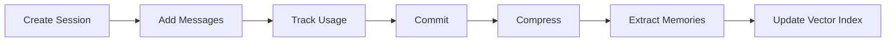
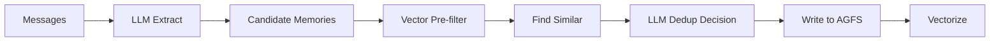

Session manages the complete conversation lifecycle: message recording, context tracking, compression, and automatic memory extraction.

## Overview

**Session Lifecycle**: Create → Interact → Commit



<Steps>
  <Step title="Create Session">
    Initialize a new conversation session with unique ID
  </Step>
  <Step title="Add Messages">
    Record user and assistant messages with multimodal content
  </Step>
  <Step title="Track Usage">
    Record which contexts and skills were used
  </Step>
  <Step title="Commit">
    Trigger compression and memory extraction
  </Step>
  <Step title="Compress">
    Archive older messages, keep recent N rounds
  </Step>
  <Step title="Extract Memories">
    Extract 6-category memories from conversation
  </Step>
  <Step title="Update Index">
    Vectorize and index extracted memories
  </Step>
</Steps>

## Core API

### Session Creation

```python
from openviking import OpenViking

client = OpenViking()

# Create or resume session
session = client.session(session_id="chat_001")

# Auto-generated session ID if not provided
session = client.session()  # Generates unique ID
print(session.session_id)   # e.g., "sess_abc123"
```

### add_message

Add conversation messages with multimodal content:

```python
# User message
await session.add_message(
    role="user",
    parts=[
        {"type": "text", "text": "How do I configure embedding?"}
    ]
)

# Assistant message with context references
await session.add_message(
    role="assistant",
    parts=[
        {"type": "text", "text": "Here's how to configure embedding..."},
        {
            "type": "context",
            "uri": "viking://resources/docs/config.md",
            "abstract": "Configuration guide for OpenViking"
        }
    ]
)

# Multimodal message
await session.add_message(
    role="user",
    parts=[
        {"type": "text", "text": "What's in this image?"},
        {"type": "image", "url": "file:///path/to/image.png"}
    ]
)
```

### used

Record context and skill usage:

```python
# Record used contexts (updates active_count)
await session.used(
    contexts=[
        "viking://resources/docs/config.md",
        "viking://user/memories/preferences/coding"
    ]
)

# Record used skill
await session.used(
    skill={
        "uri": "viking://agent/skills/code-search",
        "input": "search config files",
        "output": "found 3 configuration files",
        "success": True
    }
)
```

### commit

Trigger compression and memory extraction:

```python
result = await session.commit()

print(result)
# {
#   "status": "committed",
#   "memories_extracted": 5,
#   "active_count_updated": 2,
#   "archived": True
# }
```

## Message Structure

### Message

```python
from dataclasses import dataclass
from datetime import datetime
from typing import List

@dataclass
class Message:
    id: str                  # msg_{UUID}
    role: str                # "user" | "assistant"
    parts: List[Part]        # Message parts (multimodal)
    created_at: datetime
```

### Part Types

<Tabs>
  <Tab title="TextPart">
    ```python
    @dataclass
    class TextPart:
        type: str = "text"
        text: str            # Text content
    
    # Usage
    part = TextPart(text="Hello, how do I...")
    ```
  </Tab>
  
  <Tab title="ContextPart">
    ```python
    @dataclass
    class ContextPart:
        type: str = "context"
        uri: str             # Context URI
        abstract: str        # L0 abstract (for display)
    
    # Usage
    part = ContextPart(
        uri="viking://resources/docs/api.md",
        abstract="API documentation for OpenViking"
    )
    ```
  </Tab>
  
  <Tab title="ToolPart">
    ```python
    @dataclass
    class ToolPart:
        type: str = "tool"
        tool_name: str       # Tool/skill name
        input: dict          # Tool input
        output: dict         # Tool output
        success: bool        # Whether successful
    
    # Usage
    part = ToolPart(
        tool_name="search-web",
        input={"query": "OpenViking"},
        output={"results": [...]},
        success=True
    )
    ```
  </Tab>
  
  <Tab title="ImagePart">
    ```python
    @dataclass
    class ImagePart:
        type: str = "image"
        url: str             # Image URL or file path
        description: str     # Optional description
    
    # Usage
    part = ImagePart(
        url="file:///path/to/screenshot.png",
        description="Login page screenshot"
    )
    ```
  </Tab>
</Tabs>

## Compression Strategy

<Note>
Sessions automatically compress when the message count exceeds a threshold, keeping recent rounds while archiving older history.
</Note>

### Archive Flow

Auto-archive triggered by `commit()`:

<Steps>
  <Step title="Increment compression_index">
    Track which compression cycle this is
    
    ```python
    compression_index += 1  # e.g., 1, 2, 3, ...
    ```
  </Step>
  
  <Step title="Copy messages to archive">
    Move older messages to archive directory
    
    ```python
    archive_dir = f"viking://session/{session_id}/history/archive_{compression_index:03d}/"
    await copy_messages(current_messages, archive_dir)
    ```
  </Step>
  
  <Step title="Generate structured summary">
    LLM generates summary of archived segment
    
    ```python
    summary = await vlm.generate_summary(
        messages=archived_messages,
        format="structured"
    )
    ```
  </Step>
  
  <Step title="Write L0/L1 for archive">
    Create abstract and overview for archived history
    
    ```python
    await write_context(
        uri=archive_dir,
        abstract=extract_abstract(summary),
        overview=summary
    )
    ```
  </Step>
  
  <Step title="Clear current messages">
    Keep only recent N rounds in active session
    
    ```python
    current_messages = current_messages[-KEEP_RECENT_ROUNDS:]
    ```
  </Step>
</Steps>

### Summary Format

```markdown
# Session Summary

**One-line overview**: [Topic]: [Intent] | [Result] | [Status]

## Analysis
Key steps taken:
1. User asked about OAuth implementation
2. Retrieved OAuth 2.0 documentation
3. Provided code examples
4. User requested clarification on token refresh
5. Explained refresh token flow

## Primary Request and Intent
User's core goal: Implement OAuth 2.0 authentication in their API service

## Key Concepts
- OAuth 2.0 authorization flow
- Access tokens and refresh tokens
- Token validation and expiration

## Pending Tasks
- Implement token storage mechanism
- Add token refresh endpoint
- Test OAuth flow end-to-end
```

## Memory Extraction

<Info>
OpenViking automatically extracts 6 categories of memories from conversations, updating user and agent knowledge bases.
</Info>

### 6 Memory Categories

<Tabs>
  <Tab title="User Memories">
    | Category | Location | Mergeable | Description |
    |----------|----------|-----------|-------------|
    | **profile** | `user/.overview.md` | ✅ Yes | User identity, attributes |
    | **preferences** | `user/memories/preferences/` | ✅ Yes | User preferences by topic |
    | **entities** | `user/memories/entities/` | ✅ Yes | People, projects, concepts |
    | **events** | `user/memories/events/` | ❌ No | Historical events, decisions |
  </Tab>
  
  <Tab title="Agent Memories">
    | Category | Location | Mergeable | Description |
    |----------|----------|-----------|-------------|
    | **cases** | `agent/memories/cases/` | ❌ No | Problem + solution pairs |
    | **patterns** | `agent/memories/patterns/` | ✅ Yes | Reusable best practices |
  </Tab>
</Tabs>

### Extraction Flow



<Steps>
  <Step title="LLM Extract">
    Extract candidate memories from conversation
    
    ```python
    candidates = await memory_extractor.extract(
        messages=session_messages,
        categories=["profile", "preferences", "entities", ...]
    )
    ```
  </Step>
  
  <Step title="Vector Pre-filter">
    Find similar existing memories using vector search
    
    ```python
    for candidate in candidates:
        similar = await vector_index.search(
            query=candidate.content,
            target_uri=f"viking://user/memories/{candidate.category}/",
            limit=5
        )
    ```
  </Step>
  
  <Step title="LLM Dedup Decision">
    LLM decides: skip, create, or merge
    
    ```python
    decision = await deduplicator.decide(
        candidate=candidate,
        existing=similar_memories
    )
    # Returns: {"candidate": "create", "items": [{"action": "merge", "uri": ...}]}
    ```
  </Step>
  
  <Step title="Write to AGFS">
    Execute dedup decision
    
    ```python
    if decision.candidate == "create":
        await write_memory(candidate)
    elif decision.candidate == "skip":
        pass  # Duplicate, skip
    ```
  </Step>
  
  <Step title="Vectorize">
    Index new/updated memories
    
    ```python
    await embedding_queue.enqueue(memory_context)
    ```
  </Step>
</Steps>

### Dedup Decisions

<AccordionGroup>
  <Accordion title="Candidate Decisions">
    | Decision | Description |
    |----------|-------------|
    | `skip` | Candidate is duplicate, skip and do nothing |
    | `create` | Create candidate memory (optionally delete conflicting existing memories first) |
    | `none` | Do not create candidate; resolve existing memories by item decisions |
  </Accordion>
  
  <Accordion title="Item Decisions (Per-existing memory)">
    | Decision | Description |
    |----------|-------------|
    | `merge` | Merge candidate content into specified existing memory |
    | `delete` | Delete specified conflicting existing memory |
  </Accordion>
</AccordionGroup>

### Example: Dedup Decision

```python
# Candidate memory
candidate = {
    "category": "preferences",
    "topic": "coding",
    "content": "User prefers TypeScript over JavaScript and uses ESLint for linting"
}

# Existing similar memory
existing = {
    "uri": "viking://user/memories/preferences/coding",
    "content": "User prefers TypeScript over JavaScript"
}

# LLM dedup decision
decision = {
    "candidate": "create",  # Create new memory
    "items": [
        {
            "uri": "viking://user/memories/preferences/coding",
            "action": "merge"  # Merge into existing
        }
    ]
}

# Result: Existing memory updated to:
# "User prefers TypeScript over JavaScript and uses ESLint for linting"
```

## Storage Structure

### Session Directory

```
viking://session/{user_space}/{session_id}/
├── messages.jsonl            # Current messages (JSONL format)
├── .abstract.md              # L0: Current session summary
├── .overview.md              # L1: Current session overview
├── .meta.json                # Session metadata
├── history/                  # Archived history
│   ├── archive_001/
│   │   ├── messages.jsonl    # Archived messages
│   │   ├── .abstract.md      # Archive summary
│   │   └── .overview.md      # Archive overview
│   ├── archive_002/
│   └── archive_NNN/
└── tools/                    # Tool executions
    └── {tool_id}/
        └── tool.json         # Tool call record
```

### Memory Directories

```
viking://user/{user_space}/memories/
├── .overview.md              # User profile (appendable)
├── preferences/              # User preferences
│   ├── coding/               # Topic-based organization
│   ├── communication/
│   └── tools/
├── entities/                 # Entity memories
│   ├── project_openviking/
│   ├── colleague_alice/
│   └── concept_rag/
└── events/                   # Event records
    ├── 2024-01-15_decided_refactor/
    └── 2024-02-20_completed_feature/

viking://agent/{agent_space}/memories/
├── cases/                    # Specific problem-solution pairs
│   ├── debug_import_error/
│   └── fix_api_timeout/
└── patterns/                 # Reusable patterns
    ├── debugging_workflow/
    └── code_review_checklist/
```

## Complete Example

```python
from openviking import OpenViking

client = OpenViking()

# Create session
session = client.session(session_id="oauth_help")

# User asks question
await session.add_message(
    "user",
    [{"type": "text", "text": "I prefer using TypeScript for all my projects. How do I implement OAuth?"}]
)

# Search for relevant contexts
results = await client.search(
    "OAuth implementation in TypeScript",
    session_info=session
)

# Record used contexts
await session.used(
    contexts=[ctx.uri for ctx in results.resources[:3]]
)

# Assistant responds
await session.add_message(
    "assistant",
    [
        {"type": "text", "text": "Here's how to implement OAuth in TypeScript..."},
        {"type": "context", "uri": results.resources[0].uri, "abstract": results.resources[0].abstract}
    ]
)

# Commit session (triggers compression + memory extraction)
result = await session.commit()

print(f"Extracted {result['memories_extracted']} memories")
# Automatically extracted:
# - preference: "User prefers TypeScript for projects"
# - entity: "OAuth implementation project"
# - case: "OAuth implementation in TypeScript"

# Later: Search user preferences
prefs = await client.find(
    "language preferences",
    target_uri="viking://user/memories/preferences/"
)

for pref in prefs.memories:
    overview = await client.overview(pref.uri)
    print(f"Preference: {overview}")
    # Output: "User prefers TypeScript for all projects..."
```

## Related Concepts

<CardGroup cols={2}>
  <Card title="Architecture" icon="diagram-project" href="/concepts/architecture">
    System architecture and data flow
  </Card>
  <Card title="Context Types" icon="shapes" href="/concepts/context-types">
    6 memory categories explained
  </Card>
  <Card title="Extraction" icon="file-import" href="/concepts/extraction">
    Memory extraction pipeline
  </Card>
  <Card title="Retrieval" icon="magnifying-glass" href="/concepts/retrieval">
    How memories are searched
  </Card>
</CardGroup>