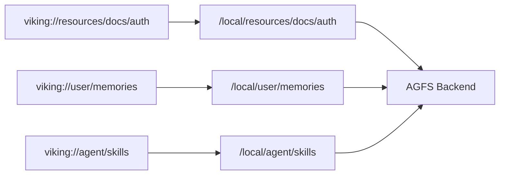
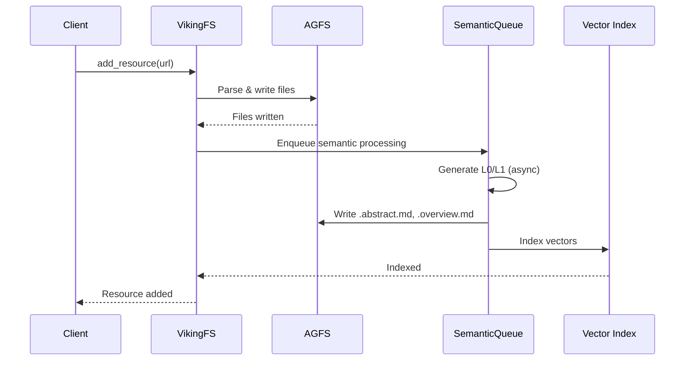
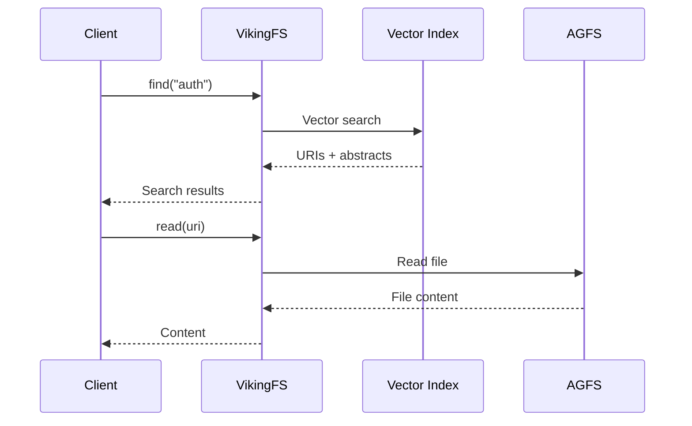

OpenViking uses a **dual-layer storage architecture** that separates content storage from index storage, providing clear separation of concerns and enabling independent scaling.

## Architecture Overview

```
┌─────────────────────────────────────────┐
│  VikingFS (URI Abstraction Layer)         │
│  • URI Mapping                             │
│  • Hierarchical Access                     │
│  • Relation Management                     │
└────────────────┬────────────────────────┘
         ┌────────┼────────┐
         │                 │
┌────────▼────────┐  ┌─────▼───────────┐
│  Vector Index   │  │      AGFS        │
│  (Semantic      │  │  (Content       │
│   Search)       │  │   Storage)      │
│                 │  │                 │
│ • URIs          │  │ • L0/L1/L2      │
│ • Vectors       │  │ • Files         │
│ • Metadata      │  │ • Relations     │
│ • No content    │  │ • Multimedia    │
└─────────────────┘  └─────────────────┘
```

## Dual-Layer Design

<CardGroup cols={2}>
  <Card title="AGFS - Content Storage" icon="database">
    Stores all actual file content
    
    - L0/L1/L2 full content
    - Multimedia files
    - Relations and metadata
    - POSIX-style operations
  </Card>

  <Card title="Vector Index - Semantic Search" icon="magnifying-glass">
    Stores only references and vectors
    
    - URIs (pointers to AGFS)
    - Dense/sparse vectors
    - Metadata fields
    - No file content
  </Card>
</CardGroup>

### Design Benefits

<AccordionGroup>
  <Accordion title="Clear Responsibilities">
    - **Vector Index**: Handles semantic retrieval and filtering
    - **AGFS**: Handles content storage and file operations
    - No overlap in responsibilities
  </Accordion>
  
  <Accordion title="Memory Optimization">
    - Vector index doesn't store file content, saving memory
    - Only URIs and vectors in index
    - Actual content read from AGFS on demand
  </Accordion>
  
  <Accordion title="Single Data Source">
    - All content read from AGFS (single source of truth)
    - Vector index only stores references
    - Eliminates data synchronization issues
  </Accordion>
  
  <Accordion title="Independent Scaling">
    - Vector index can scale independently for search performance
    - AGFS can scale independently for storage capacity
    - Different backends for different needs
  </Accordion>
</AccordionGroup>

## VikingFS: Virtual Filesystem

VikingFS is the unified URI abstraction layer that hides underlying storage details and provides a consistent interface.

### URI Mapping



VikingFS maps virtual URIs to physical paths in the AGFS backend.

### Core API

<Tabs>
  <Tab title="File Operations">
    ```python
    from openviking.storage.viking_fs import get_viking_fs
    
    viking_fs = get_viking_fs()
    
    # Read file content (L2)
    content = await viking_fs.read(
        "viking://resources/docs/api.md"
    )
    
    # Write file
    await viking_fs.write(
        "viking://resources/docs/new.md",
        "# New Document\n..."
    )
    
    # Create directory
    await viking_fs.mkdir("viking://resources/new-project/")
    
    # Delete file/directory
    await viking_fs.rm(
        "viking://resources/old-project/",
        recursive=True
    )
    
    # Move/rename
    await viking_fs.mv(
        "viking://resources/docs/old.md",
        "viking://resources/docs/new.md"
    )
    ```
  </Tab>
  
  <Tab title="Layer Operations">
    ```python
    # Read L0 abstract
    abstract = await viking_fs.abstract(
        "viking://resources/docs/"
    )
    
    # Read L1 overview
    overview = await viking_fs.overview(
        "viking://resources/docs/"
    )
    
    # Write context (L0/L1/L2)
    await viking_fs.write_context(
        uri="viking://resources/docs/auth/",
        abstract="Brief auth summary",
        overview="Detailed auth overview\n...",
        is_leaf=False
    )
    ```
  </Tab>
  
  <Tab title="Relation Management">
    ```python
    # Create relation
    await viking_fs.link(
        from_uri="viking://resources/docs/auth",
        uris=["viking://resources/docs/security"],
        reason="Related security docs"
    )
    
    # Get relations
    relations = await viking_fs.relations(
        "viking://resources/docs/auth"
    )
    
    for rel in relations:
        print(f"Related: {rel.uri} - {rel.reason}")
    ```
  </Tab>
  
  <Tab title="Search Integration">
    ```python
    # Semantic search (uses vector index)
    results = await viking_fs.find(
        query="authentication methods",
        target_uri="viking://resources/"
    )
    
    # Results contain URIs and abstracts
    for ctx in results.resources:
        # Full content loaded from AGFS on demand
        content = await viking_fs.read(ctx.uri)
    ```
  </Tab>
</Tabs>

## AGFS: Backend Storage

AGFS (Agent Filesystem) provides POSIX-style file operations with multiple backend support.

### Backend Types

<Tabs>
  <Tab title="LocalFS (Default)">
    **Local filesystem storage**
    
    ```json
    {
      "storage": {
        "workspace": "/home/user/openviking_workspace"
      }
    }
    ```
    
    - Uses local disk for storage
    - Best for development and single-node deployment
    - Fast read/write performance
  </Tab>
  
  <Tab title="S3FS">
    **S3-compatible object storage**
    
    ```json
    {
      "storage": {
        "backend": "s3fs",
        "bucket": "openviking-data",
        "endpoint": "https://s3.amazonaws.com",
        "access_key": "...",
        "secret_key": "..."
      }
    }
    ```
    
    - Uses S3 for distributed storage
    - Supports AWS S3, MinIO, Aliyun OSS, etc.
    - Enables multi-node deployment
  </Tab>
  
  <Tab title="Memory (Testing)">
    **In-memory storage**
    
    ```python
    # Only available in code, not config
    from openviking.storage.agfs import MemoryFS
    
    agfs = MemoryFS()
    ```
    
    - Uses RAM for storage
    - Best for testing and temporary use
    - Data lost when process ends
  </Tab>
</Tabs>

### Directory Structure

Each context directory follows a unified structure in AGFS:

```
viking://resources/docs/auth/
├── .abstract.md          # L0: Abstract (~100 tokens)
├── .overview.md          # L1: Overview (~2k tokens)
├── .relations.json       # Relations table
├── .meta.json            # Metadata (timestamps, etc.)
├── oauth.md              # L2: Full OAuth docs
├── jwt.md                # L2: Full JWT docs
└── api-keys.md           # L2: Full API key docs
```

<Info>
All these files are physically stored in AGFS. The vector index only stores references to them.
</Info>

## Vector Index

The vector index stores semantic indices, supporting vector search and scalar filtering.

### Context Collection Schema

| Field | Type | Description |
|-------|------|-------------|
| `id` | string | Primary key (UUID) |
| `uri` | string | Resource URI (references AGFS) |
| `parent_uri` | string | Parent directory URI |
| `context_type` | string | resource/memory/skill |
| `is_leaf` | bool | Whether leaf node (file vs directory) |
| `vector` | vector | Dense vector (1024 or 3072 dims) |
| `sparse_vector` | sparse_vector | Sparse vector (optional) |
| `abstract` | string | L0 abstract text (for display) |
| `level` | int | Context level (0=L0, 1=L1, 2=L2) |
| `name` | string | Resource name |
| `description` | string | Description (for skills) |
| `created_at` | string | Creation timestamp |
| `updated_at` | string | Update timestamp |
| `active_count` | int64 | Usage count |
| `account_id` | string | Account identifier |
| `owner_space` | string | User/agent space |

### Index Strategy

```python
index_meta = {
    "IndexType": "flat_hybrid",  # Hybrid index (dense + sparse)
    "Distance": "cosine",        # Cosine similarity
    "Quant": "int8",             # Quantization for memory efficiency
}
```

<Note>
The vector index uses hybrid search combining dense and sparse vectors for better retrieval accuracy.
</Note>

### Backend Support

<Tabs>
  <Tab title="Local (Default)">
    **Local persistence using embedded vector DB**
    
    ```json
    {
      "vectordb": {
        "type": "local",
        "path": "/home/user/openviking_workspace/vectordb"
      }
    }
    ```
    
    - Embedded vector database
    - Best for development and small deployments
    - No external dependencies
  </Tab>
  
  <Tab title="HTTP Remote">
    **Remote vector service via HTTP**
    
    ```json
    {
      "vectordb": {
        "type": "http",
        "url": "http://vectordb-service:8080"
      }
    }
    ```
    
    - Connects to remote vector service
    - Enables distributed deployment
    - Shared vector index across multiple clients
  </Tab>
  
  <Tab title="Volcengine VikingDB">
    **Volcengine managed vector database**
    
    ```json
    {
      "vectordb": {
        "type": "volcengine",
        "host": "api-vikingdb.volces.com",
        "region": "cn-beijing",
        "ak": "your-access-key",
        "sk": "your-secret-key"
      }
    }
    ```
    
    - Fully managed vector database service
    - High performance and scalability
    - Production-ready
  </Tab>
</Tabs>

## Vector Synchronization

<Warning>
VikingFS automatically maintains consistency between vector index and AGFS. Manual synchronization is not needed.
</Warning>

### Delete Sync

When deleting from AGFS, vector index is automatically updated:

```python
# Delete directory
await viking_fs.rm("viking://resources/docs/auth", recursive=True)

# Automatically:
# 1. Deletes files from AGFS
# 2. Deletes all records with URI prefix "viking://resources/docs/auth" from vector index
```

### Move Sync

When moving/renaming in AGFS, vector index URIs are updated:

```python
# Move directory
await viking_fs.mv(
    "viking://resources/docs/auth",
    "viking://resources/docs/authentication"
)

# Automatically:
# 1. Moves files in AGFS
# 2. Updates uri and parent_uri fields in vector index
# 3. Updates all descendant URIs
```

### Write Sync

When writing new content, vector index is updated:

```python
# Write new resource
await viking_fs.write_context(
    uri="viking://resources/docs/new/",
    abstract="New documentation",
    overview="Detailed overview...",
    is_leaf=False
)

# Automatically:
# 1. Writes .abstract.md and .overview.md to AGFS
# 2. Enqueues embedding generation
# 3. Adds vector records to index after embedding
```

## Data Flow Example

### Adding a Resource



### Searching and Reading



## Implementation Example

<CodeGroup>
```python VikingFS API
from openviking.storage.viking_fs import VikingFS

class VikingFS:
    """Virtual filesystem with URI abstraction."""
    
    def __init__(self, agfs, vector_index):
        self.agfs = agfs  # Content storage
        self.vector_index = vector_index  # Semantic index
    
    async def read(self, uri: str) -> str:
        """Read file content from AGFS."""
        return await self.agfs.read_file(uri)
    
    async def write(self, uri: str, data: str):
        """Write file to AGFS."""
        await self.agfs.write_file(uri, data)
    
    async def abstract(self, uri: str) -> str:
        """Read L0 abstract."""
        return await self.agfs.read_file(
            f"{uri.rstrip('/')}/.abstract.md"
        )
    
    async def overview(self, uri: str) -> str:
        """Read L1 overview."""
        return await self.agfs.read_file(
            f"{uri.rstrip('/')}/.overview.md"
        )
    
    async def find(self, query: str, target_uri: str = None):
        """Semantic search using vector index."""
        # Vector index returns URIs + metadata
        results = await self.vector_index.search(
            query=query,
            filter={"parent_uri": target_uri} if target_uri else None
        )
        # Content loaded from AGFS on demand
        return results
```

```python Storage Configuration
# ov.conf
{
  "storage": {
    "workspace": "/home/user/openviking_workspace",
    "backend": "localfs"  # or "s3fs"
  },
  "vectordb": {
    "type": "local",  # or "http", "volcengine"
    "path": "/home/user/openviking_workspace/vectordb"
  }
}
```
</CodeGroup>

## Related Concepts

<CardGroup cols={2}>
  <Card title="Architecture" icon="diagram-project" href="/concepts/architecture">
    System architecture overview
  </Card>
  <Card title="Context Layers" icon="layer-group" href="/concepts/context-layers">
    L0/L1/L2 progressive loading
  </Card>
  <Card title="Viking URI" icon="link" href="/concepts/viking-uri">
    URI specification and operations
  </Card>
  <Card title="Retrieval" icon="magnifying-glass" href="/concepts/retrieval">
    How vector index is used for search
  </Card>
</CardGroup>